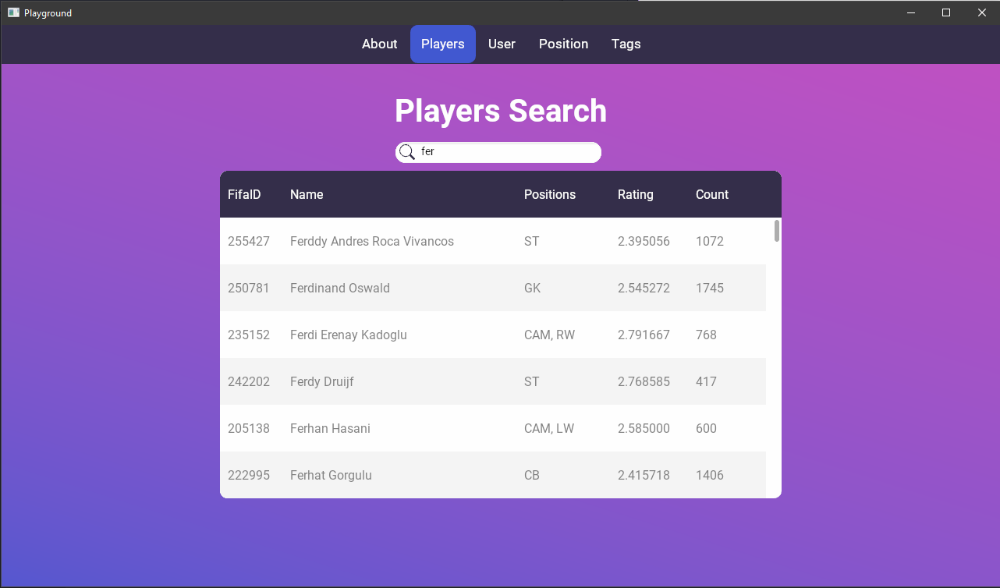
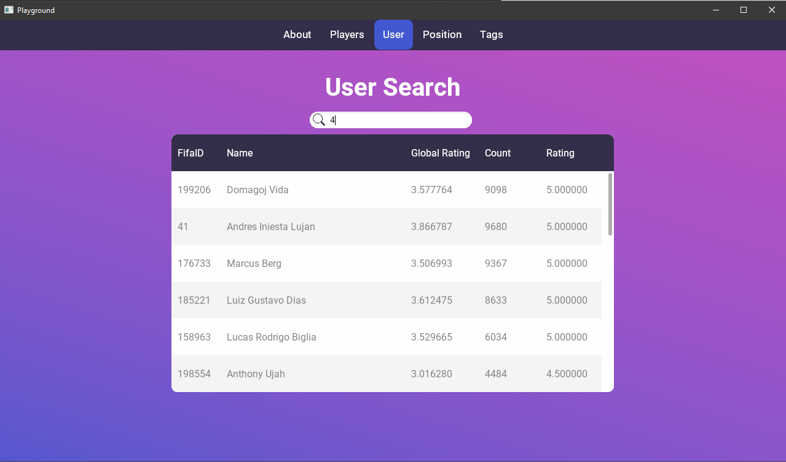
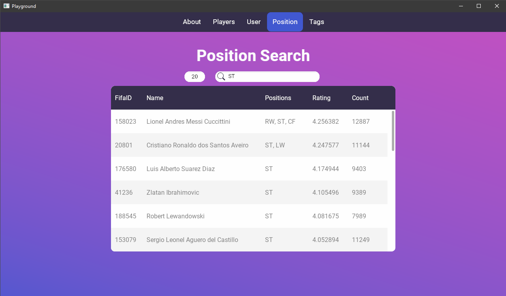
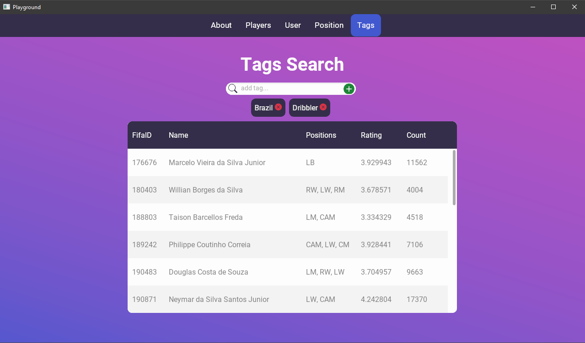

# FIFA21-Players

Final project for INF01124 class at [UFRGS](http://www.ufrgs.br/english/home)

- Students: Pedro Afonso Klein & Henrique Utzig
- Semester: 2021/2 (ERE)
- Date: 2022/05/05

---
## Getting Started

### Prerequisites
- Node >= 16
- yarn
- C++ 17
- Cmake

### Setting up
```bash
cd app
yarn install
yarn build
cd ..
cmake --build ./build --config Release --target FIFA21-Players
cd build/Release
FIFA21-Players.exe
```
* On windows use MSVC to compile


---

## Dataset

The dataset is composed of 5 csv files and all were given by the professor.

- [minirating.csv](data/minirating.csv)
- [players_21.csv](data/players_21.csv)
- [players.csv](data/players.csv)
- [rating.csv](data/rating.csv)
- [tags.csv](data/tags.csv)

---

## Used Data Structures

- Hash Tables
- Trie Tree
- RB Tree

---

## Available Searches

- Search players date by name
- Search user-given ratings by userID
- Search players by given set of tags
- Search top N best players in a given position (1 <= N <= 100)

---

## Benchmark

|                 | i5-4440/MSVC-17.1 | i7-7500U/g++-9.4 |
| --------------- | ----------------- | ---------------- |
| Database Init   | 13.5s             | 8.8s             |
| Player Search   | 0.25ms            | 0.4ms            |
| User Search     | 0.03ms            | 0.27ms           |
| Position Search | 0.20ms            | 0.10ms           |
| Tags Search     | 0.12ms            | 0.09ms           |

---

## GUI

UI developed using [Ultralight](https://github.com/ultralight-ux/Ultralight) with [React](https://github.com/facebook/react)

### Players Search Screen



### User Search Screen



### Position Search Screen



### Tags Search Screen


